# Entity-Relationship Diagram (ERD) - BimbelSync

Berikut adalah struktur skema relasional dari platform BimbelSync (menggunakan format Mermaid.js). Skema ini memisahkan lingkup SaaS platform-level, operasional akademi (tenant), sistem tagihan klien-ke-bimbel, dan sistem tagihan berlangganan bimbel-ke-platform.

```mermaid
erDiagram
    %% ================= SAAS LEVEL =================
    SUPERADMIN ||--o{ ACADEMY : "manages"
    SUPERADMIN ||--o{ PLATFORM_INVOICES : "verifies"
    PLANS ||--o{ ACADEMY : "subscribed_to"
    PLANS ||--o{ PLATFORM_INVOICES : "priced_by"
    ACADEMY ||--o{ PLATFORM_INVOICES : "billed_for_subscription"
    ACADEMY ||--o{ STAFF : "employs"
    ACADEMY ||--o{ STUDENTS : "has_students"
    ACADEMY ||--o{ PROGRAMS : "offers"
    ACADEMY ||--o{ ROOMS : "owns"
    ACADEMY ||--o{ INVOICES : "issues"

    %% ================= OPERATIONAL =================
    STAFF ||--o{ SCHEDULES : "teaches"
    ROOMS ||--o{ SCHEDULES : "hosts"
    PROGRAMS ||--o{ SCHEDULES : "has_sessions"

    STUDENTS ||--o{ ENROLLMENTS : "registers_in"
    PROGRAMS ||--o{ ENROLLMENTS : "includes"

    STUDENTS ||--o{ ATTENDANCES : "records"
    SCHEDULES ||--o{ ATTENDANCES : "logged_in"

    %% ================= FINANCIAL (TENANT: SISWA -> BIMBEL) =================
    STUDENTS ||--o{ INVOICES : "billed_to"
    STAFF ||--o{ INVOICES : "verifies (manual payment only)"
    INVOICES ||--o{ INVOICE_ITEMS : "contains"
    INVOICES ||--o{ INSTALLMENTS : "scheduled_as (if payment_option = INSTALLMENT)"
    STAFF ||--o{ INSTALLMENTS : "verifies (manual payment only)"

    %% ================= MASTER / IDENTITY — soft delete (deleted_at) =================
    SUPERADMIN {
        uuid id PK
        string email UK
        string password_hash
        datetime last_login
        datetime deleted_at
    }

    PLANS {
        uuid id PK
        string name "Starter, Growth, Pro"
        int price "monthly price in IDR"
        int max_students "nullable = unlimited"
        int max_staff "nullable = unlimited"
        int max_rooms "nullable = unlimited"
        boolean allows_payment_gateway "feature gate: BYOK Midtrans/Xendit"
        boolean allows_installment "feature gate: cicilan"
        boolean is_active "whether currently offered to new signups"
        datetime deleted_at
    }

    ACADEMY {
        uuid id PK
        uuid plan_id FK
        string name
        string path_url UK "subdomain / tenant slug"
        string encrypted_payment_server_key "BYOK Midtrans/Xendit, encrypted at rest"
        int max_leave_per_month "configurable per tenant, not global"
        enum subscription_status "TRIAL, ACTIVE, SUSPENDED"
        date subscription_due_date
        datetime deleted_at
    }

    ROOMS {
        uuid id PK
        uuid academy_id FK
        string name
        int capacity
        datetime deleted_at
    }

    STAFF {
        uuid id PK
        uuid academy_id FK
        string email "unique per academy_id, partial index WHERE deleted_at IS NULL"
        string password_hash
        enum role "ADMIN, TUTOR"
        datetime deleted_at
    }

    STUDENTS {
        uuid id PK
        uuid academy_id FK
        string full_name
        string username "unique per academy_id, partial index WHERE deleted_at IS NULL"
        string password_hash
        boolean must_change_password "default true, forces reset on first login after (re)generation"
        string parent_whatsapp "for billing/notification + password delivery"
        datetime deleted_at
    }

    PROGRAMS {
        uuid id PK
        uuid academy_id FK
        string name
        int max_capacity
        int monthly_fee
        int duration_months "nullable - null means ongoing/regular class, filled means fixed-term intensive package"
        datetime deleted_at
    }

    %% ================= TRANSACTIONAL / EVENT — explicit status, NOT deleted_at =================
    SCHEDULES {
        uuid id PK
        uuid program_id FK
        uuid tutor_id FK
        uuid room_id FK
        datetime start_time
        datetime end_time
        enum status "SCHEDULED, CANCELLED"
        string cancelled_reason "nullable, filled only when status = CANCELLED"
    }

    ATTENDANCES {
        uuid id PK
        uuid student_id FK
        uuid schedule_id FK "unique (student_id, schedule_id) - no double scan"
        datetime scanned_at
        enum attendance_status "PRESENT, EXCUSED, ABSENT"
    }

    ENROLLMENTS {
        uuid id PK
        uuid student_id FK
        uuid program_id FK "unique (student_id, program_id) WHERE status = 'ACTIVE' - allows re-enroll after withdrawal"
        datetime enrolled_date
        enum status "ACTIVE, WITHDRAWN"
        datetime withdrawn_at "nullable, filled only when status = WITHDRAWN"
        enum withdrawn_reason "nullable - PINDAH_DOMISILI, TIDAK_PUAS_LAYANAN, KENDALA_BIAYA, PROGRAM_SELESAI, LAINNYA"
        string withdrawn_notes "nullable, catatan bebas pelengkap kategori di atas"
    }

    INVOICES {
        uuid id PK
        uuid academy_id FK
        uuid student_id FK
        uuid verified_by_staff_id FK "nullable - null if auto-paid via gateway webhook, or if payment_option = INSTALLMENT"
        int total_amount "snapshot at generation time - immutable, not recalculated"
        enum payment_option "FULL, INSTALLMENT"
        string payment_url "nullable if payment_option = INSTALLMENT, or payment_method = MANUAL_TRANSFER/CASH"
        string proof_of_payment_url "nullable - only used when payment_option = FULL and manual"
        enum payment_method "GATEWAY, MANUAL_TRANSFER, CASH - only meaningful when payment_option = FULL"
        enum payment_status "VOID, UNPAID, PAID, OVERDUE - derived/aggregate from INSTALLMENTS when payment_option = INSTALLMENT"
    }

    INVOICE_ITEMS {
        uuid id PK
        uuid invoice_id FK
        string description
        int amount
    }

    INSTALLMENTS {
        uuid id PK
        uuid invoice_id FK
        int installment_number "1, 2, 3, ... - unique (invoice_id, installment_number)"
        date due_date
        int amount
        enum status "UNPAID, PAID, OVERDUE"
        datetime paid_at "nullable"
        enum payment_method "GATEWAY, MANUAL_TRANSFER, CASH"
        string payment_url "nullable - own Midtrans/Xendit transaction per installment"
        string proof_of_payment_url "nullable"
        uuid verified_by_staff_id FK "nullable"
    }

    %% ================= PLATFORM BILLING (BIMBEL -> BIMBELSYNC) =================
    PLATFORM_INVOICES {
        uuid id PK
        uuid academy_id FK
        uuid plan_id FK
        date billing_period "e.g. first day of billed month"
        int amount "snapshot of plan price at billing time"
        date due_date
        enum payment_status "VOID, UNPAID, PAID, OVERDUE"
        datetime paid_at "nullable"
        uuid verified_by_superadmin_id FK "nullable"
        string proof_of_payment_url "nullable"
    }
```

